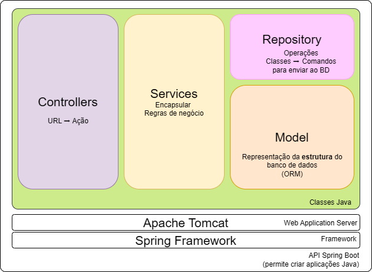
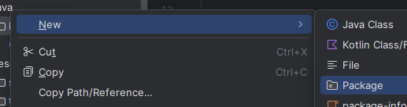
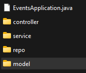
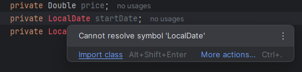
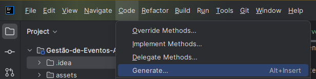
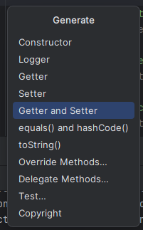
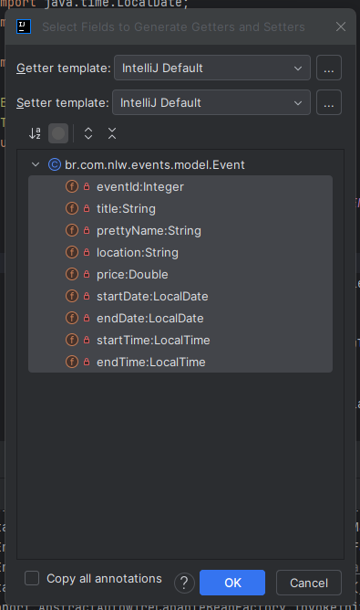

[](https://git.io/typing-svg)

Bem-vindo a API para Gestão de Eventos, um projeto desenvolvido com objetivo de gerenciar eventos e suas respectivas inscrições, gerar links de indicação, validar as regras de negócio, e acompanhar ranking de indicações.

<p align="center">
  <a href="#-tecnologias-utilizadas">🛠 Tecnologias Utilizadas</a>&nbsp;&nbsp;&nbsp;|&nbsp;&nbsp;&nbsp;
  <a href="#-tecnologias-utilizadas">🧠 Como Usar</a>
</p>


# 🚧 Em construção... 🚧

Nessa trilha, explorei conceitos fundamentais do e **Java** e **Spring Boot**, mergulhando na prática para construir uma aplicação completa de **inscrição em eventos**.  

Ao longo do curso, configurei o ambiente de desenvolvimento, utilizamos o **Spring Initializr** para criar nosso projeto e conectamos a aplicação a um banco de dados **MySQL**.  

## ✨ Funcionalidades

- 📌 **Inscrição**: O usuário pode se inscrever no evento usando nome e e-mail.
- 🔗 **Geração de Link de Indicação**: O usuário pode gerar um link de indicação (um por inscrito).
- 📊 **Ranking de Indicações**: O usuário pode ver o ranking de indicações.
- 👥 **Visualização de Indicações**: O usuário pode ver a quantidade de inscritos que ingressaram com seu link.

## 🛠 Tecnologias Utilizadas

- **Docker Desktop** 4.38.0
- **MySQL Workbench** 8.0.41 Community
- **IntelliJ IDEA** 2024.3.3 (Community Edition)
- **Postman** v11.33.4

- **Java** 23.0.2

- **Maven**  
- **Lombok**
- **MySQL** 8.4
- **Spring Boot** 3.4.2
- **Dependências**:
  - Spring Web
  - Spring Data JPA
  - MySQL Driver
  - Spring Boot DevTools

## 📋 Rotas da API

Principais rotas da API:

🎟️ Eventos

- Criar um evento
    ```
    (POST) /events
    ```
- Listar todos os eventos
    ```
    (GET) /events
    ```
- Obter evento por nome formatado
    ```
    (GET) /events/{prettyName}
    ```

📝 Inscrição

- Realizar inscrição no evento
    ```
    (POST) /subscription/{prettyName}
    ```
- Ver indicações de um usuário específico
    ```
    (GET) /subscription/{prettyName}/ranking/{userId}
    ```

↗️ Rankings

- Visualizar ranking de indicações de um evento
    ```
    (GET) /subscription/{prettyName}/ranking/{userId}
    ```
- Visualizar ranking de indicações de um usuário específico
    ```
    (GET) /subscription/{prettyName}/ranking
    ```


## 📂 Estrutura do Projeto

### Arquivos e Diretórios
```
Sistema-De-Inscricao-Em-Eventos-API-Java-nlw-connect
├── 📂 assets/ 
│    │   
├── 📄 README.md

```
### Diagrama de Deployment (Estrutura da API)


### Diagrama Entidade-Relacionamento (DER)


- Um usuário pode ter várias inscrições em eventos, mas não pode se inscrever em um evento mais de uma vez.
- Um evento pode ter vários usuários inscritos.

# O que é ...

## ... uma API? 

Uma API (do inglês Application Programming Interface, ou Interface de Programação de Aplicações) é um conjunto de regras, protocolos e ferramentas que permite que diferentes sistemas ou componentes de software se comuniquem entre si. Ela define como as solicitações e respostas devem ser estruturadas, permitindo que desenvolvedores integrem funcionalidades de um sistema em outro sem precisar entender todos os detalhes internos de implementação.

> "Ela é um sistema que 'alimenta' outros sistemas, permitindo que eles se comuniquem e troquem informações."

## ... um Framework ?
Fornece uma estrutura pronta com ferramentas e bibliotecas para facilitar o desenvolvimento de aplicações.

> Estrutura de código pré fabricado.

#### Spring Boot
---
Ele faz parte do ecossistema Spring, que é um dos frameworks mais populares para desenvolvimento de aplicações em Java. O Spring Boot foi criado para simplificar o processo de configuração e desenvolvimento de aplicações Spring, permitindo que os desenvolvedores criem aplicações prontas para produção de forma rápida e eficiente.

##### Spring Initializr
---

O Spring Initializr é uma ferramenta online e também uma integração em IDEs (como IntelliJ IDEA e Eclipse) que facilita a criação de projetos Spring Boot. Ele permite que você configure rapidamente um projeto Spring Boot, escolhendo as dependências, a linguagem (Java, Kotlin ou Groovy), a versão do Spring Boot e outras configurações básicas. Em seguida, ele gera um projeto inicial (um "esqueleto") que você pode importar e começar a desenvolver.

> Gera um arquivo .ZIP com o projeto inicial com todas as dependências necessárias para começar a desenvolver uma aplicação Spring Boot.

Para gerar o seu "pacote": [Acesse Aqui](https://start.spring.io/)

Configurações escolhidas
```
Project: Maven
Language: Java
Spring Boot: 3.4.2 //sempre escolher a versão estável

Project Metadata:
Group: br.com.nlw
Artifact: events
Name: events
Description: Events Manager System
Package name: br.com.nlw.events
Packaging: Jar
Java: 23 //Escolha a menor/igual versão mais próxima da versão do Java que você está usando

Dependencies:
Spring Web
Spring Data JPA
MySQL Driver
Spring Boot DevTools
```


###### Dependências
---
- Spring Web
  - Suporte para criar aplicações web e APIs RESTful. Ele inclui o Spring MVC (Model-View-Controller), que é um framework para construir aplicações web no ecossistema Spring.
  - Usa o Apache **Tomcat** como servidor web padrão.
- Spring Data JPA
  - É uma camada de abstração sobre o JPA (Java Persistence API), que simplifica o acesso a bancos de dados relacionais. Ele permite que você interaja com o banco de dados usando interfaces e métodos, sem precisar escrever consultas SQL manualmente.
- MySQL Driver
  - É uma biblioteca que permite que sua aplicação Java se conecte a um banco de dados MySQL. 
- Spring Boot DevTools
  - Conjunto de ferramentas de desenvolvimento que aumentam a **produtividade** durante o desenvolvimento de aplicações Spring Boot. Exemplos:
    - Reinicia automaticamente a aplicação quando arquivos são alterados (sem precisar parar e iniciar manualmente).
    - Atualiza automaticamente o navegador quando recursos estáticos (como HTML, CSS, JS) são modificados.

## ... um Web Application Server ?
Um Web Application Server é um servidor que fornece um ambiente para executar aplicações web. Ele suporta tecnologias como Servlets, JSP (JavaServer Pages), EJB (Enterprise JavaBeans), JMS (Java Message Service) e outras especificações da plataforma Java EE (ou Jakarta EE).

### Apache Tomcat, ou simplesmente Tomcat
---
O Apache Tomcat é tecnicamente um Servlet Container (Contêiner de Servlets) e um JSP Container (Contêiner de JSP). Ele implementa as especificações de Servlet e JSP, que são partes essenciais da plataforma Java EE. No entanto, o Tomcat não implementa todas as especificações Java EE, como EJB, JMS ou JTA (Java Transaction API), que são comuns em servidores de aplicações completos.

Por isso, o Tomcat é frequentemente chamado de Web Server ou Servlet Container, mas também pode ser considerado um Web Application Server leve, já que ele é capaz de executar aplicações web Java, embora com funcionalidades mais limitadas em comparação a servidores de aplicações completos.

## ... um Banco de dados ?

Um banco de dados é um sistema organizado para armazenar, gerenciar e recuperar informações. Imagine uma grande biblioteca onde os livros são os dados, e as prateleiras e catálogos ajudam a encontrar o que você precisa rapidamente. Ele permite que você guarde dados de forma estruturada (como tabelas) e os acesse, atualize ou apague quando necessário. 

### 🐳 Docker
---
No contexto de bancos de dados, o Docker serve para criar e gerenciar containers que isolam e rodam bancos de dados de forma rápida, portável e consistente. Ele simplifica a configuração de ambientes.

Configurando:

1. Deixe o `Docker Desktop` executando em sua máquina. 
2. Na pasta do projeto `\assets\create_db` você irá encontrar um arquivo chamado `docker-compose.yml`. Que irá conter as seguintes informações:

<br>

`docker-compose.yml`
```
services:
  mysql:
    image: mysql:8.4
    restart: always
    container_name: mysql-nlw
    environment:
      - MYSQL_ROOT_PASSWORD=mysql
    ports: 
      - '3306:3306'
    networks: 
      - nlw-network
networks:
  nlw-network:
    driver: bridge
```

3. Entre no terminal do seu sistema operacional. E navegue até o diretório onde está o arquivo `docker-compose.yml`. Então execute o seguinte comando:
```
docker compose up
```
Assim ele criará a `Network` (rede), o `Container` e faz o upload do `MySQL` para o docker. 


4. Agora é só criar a seu Banco de Dados.

### 🔢 Criando o Banco de dados
---

1. Acesse o MySQL Workbench
2. Em `MySQL Connections`, clique em `+`
3. Então configure ele:
   - Connection Name: `Mysql NLW Docker`
4. `Ok`
5. No ícone da pasta, abra o arquivo do script do banco de dados: `db_events.sql`. Você pode encontrar ele na pasta do projeto `\assets\create_db`
6. Então execute (símbolo do raio)
7. Pronto o banco de dados esta gerado 

> Para ver o diagrama vá em Database > Reverse Enginneer > Next > Next > selecione o banco desejado > Next > Next > Execute > Next > Finish

### 🔌 Conectando Código com o Banco de Dados
---

Requisito: Dependências do `Spring Data JPA`
Caminho: `\events\src\main\resources`
Arquivo: `application.properties`

> O maior gargalo de uma aplicação é a comunicação com o banco de dados. Quanto melhor o BD, melhor a aplicação.

 ``` java
spring.application.name = events

// Nome do usuário do banco de dados
spring.datasource.username = root 

// Senha do usuário do banco de dados
spring.datasource.password = root 

// URL do banco de dados
// Protocolo: jdbc:mysql: <- Eu quero conversar atráves do JPA, pelo protocolo JAva Database Connectivity, usando o driver de conexão do MySQL
// Máquina: localhost <- A máquina que está rodando o banco de dados
// Porta: 3336 <- Porta que o banco de dados está escutando (OPCIONAL)
//Nome da base de dados: db_events
spring.datasource.url = jdbc:mysql://localhost:3306/db_events

// Configuração do JPA "Qual dialeto estou usando?" = MySQL
spring.jpa.properties.hibernate.dialect = org.hibernate.dialect.MySQLDialect
 ```
Resultado esperado: Conexões criadas com o BD


## Criando Packages

Então vamos criar os pacotes:
- Controller
- Service
- Repository
- Model




Primeiro temos que estar no caminho correto: `\events\src\main\java\br\com\nlw\events`

E crie um novo pacote:




- `.controller`
- `.service`
- `.repo`
- `.model`

Cada pacote irá criar uma nova pasta dentro do pacote `br.com.nlw.events`




## Criando Classes para Evento

### Model
---

Objetivos:
- Declarar variáveis.
- Relacionar variáveis com o BD.
- Criar métodos getters e setters.

Tipo: `Java Class`

Pasta: `model`

Nome do arquivo: `Event.java`

1. Declarar variáveis. Veja na tabela do BD, o nome das colunas e seus tipos. Para o código manter a mesma nomenclatura, para que não tenha erros. Mas use a anotação utilizada pelo Java. `primeiraLetraMaiusculaEORestanteMinuscula`

  Veja o Exemplo:


  .png>)

  Possível problema:


  

  Tipo de variável não existente, passe o mouse sob o erro e Importe a classe.

2. "Anotar" que a essa classe corresponde a uma tabela `tbl_event` do BD.

  ```java
  @Entity
  @Table (name = "tbl_event")
  ```

3. Indicar cada variável que é uma coluna da tabela.

  ```java
  @Column (name = "pretty_name", length = 50, nullable = false, unique = true)
  private String prettyName;
  ```

  Para a chave primária, use:

  ```java
  @Id
  @GeneratedValue (strategy = GenerationType.IDENTITY)
  @Column (name = "even_id")
  private Integer eventId;
  ```

4. Criar os métodos getters e setters para cada variável.

Vá no menu Code > Generate >




.> Getter and Setter >




.> Selecionar todas as variáveis > Ok




Ele irá criar os métodos getters e setters para todas as variáveis, semelhante ao exemplo abaixo:

```java
    public Integer getEventId() {
        return eventId;
    }

    public void setEventId(Integer eventId) {
        this.eventId = eventId;
    }
```

### Repository (Repo)
---

Objetivos:

Tipo: `Interface`

Pasta: `repo`

Nome do arquivo: `EventRepo.java`

1. Adicione a extensão `CrudRepository`. Ela pede dois parâmetros:
   - O que vou armazenar. No caso, a classe `Event`. 
   - Tipo da chave primária.
   
```java
public interface EventRepo extends CrudRepository <Event, Integer> {
  //aqui vai ficar os métodos extras que o CrudRepository não tem
}
```	

Com o CrudRepository, você tem acesso aos métodos:

- Create (Criar):
  - save(entity): Salva uma entidade no banco de dados (insere ou atualiza, se já existir).

- Read (Ler):
  - findById(id): Busca uma entidade pelo seu ID.
  - findAll(): Retorna todas as entidades.
  - existsById(id): Verifica se uma entidade com o ID especificado existe.

- Update (Atualizar):
  - save(entity): Atualiza uma entidade existente no banco de dados.

- Delete (Excluir):
  - deleteById(id): Remove uma entidade pelo seu ID.
  - delete(entity): Remove uma entidade específica.
  - deleteAll(): Remove todas as entidades.

### Service
---

Objetivos:
- Regras de negócio
- Cadastrar
- Recuperar todo mundo
- Recuperar pelo `prettyName`

Tipo: `Java Class`

Pasta: `service`	

Nome do arquivo: `EventService.java`


1. Adicione a anotação `Service`.
```JAVA 
@Service
public class EventService {
}
```
Mas por que? Porque o Spring vai gerenciar a criação dessa classe.

2. Chame a Classe `EventRepo` (que acabamos de criar no arquivo anterior)

```JAVA 
private EventRepo eventRepo;
```

3. Coloque a anotação `Autowired` acima do `eventRepo`

```JAVA 
@Autowired
private EventRepo eventRepo;
```

#### Autowired
----
 **Injeção de dependência** de forma automática. Ela permite que o Spring resolva e injete beans (objetos gerenciados pelo Spring) em sua classe, sem a necessidade de configurar manualmente as dependências.

Como funciona?
Quando você anota um campo, método ou construtor com @Autowired, o Spring procura no contexto da aplicação por um bean que corresponda ao tipo da dependência e o injeta automaticamente.

Vamos fazer um ilustração para compreender melhor como o autowired funciona.


.png>)

#### Método Adicionar o Gerador de Pretty Name
---

Objetivos:
- Nome Do Meu Evento  -> nome-do-meu-evento

Nome do arquivo: `EventService.java`

Eu vou receber um Evento com alguns dados, e vou salvar no BD com o novo campo adicionado o prettyName.

  ```JAVA
    public Event addNewEvent (Event event){

        //gerar o Pretty Name
        event.setPrettyName(event.getTitle().toLowerCase().replaceAll(" ", "-"));
        return eventRepo.save(event);
    }
  ```


#### Método Listar Todos os Eventos
---

Nome do arquivo: `EventService.java`

  ```JAVA
    public List<Event> getAllEvents(){
        return (List<Event>)eventRepo.findAll();
    }
  ```

#### Método Listar Todos os Eventos pelo Pretty Name
---

Nome do arquivo: `EventService.java`

  ```JAVA
    public Event getByPrettyName(String prettyName){
        return eventRepo.findByPrettyName(prettyName);
    }
  ```


.png>)

Nome do arquivo: `EventRepo.java`
```JAVA
    public Event findByPrettyName(String prettyName);
```

##### Spring Data JPA: Palavras-chave de Consulta
---

Relembrando, a dependência `Spring Data JPA`, é um framework que facilita o acesso a bancos de dados relacionais usando JPA (Java Persistence API). Ele permite que você crie consultas ao banco de dados de forma simples, sem precisar escrever SQL manualmente. Em vez disso, você pode definir métodos em uma interface, e o Spring Data JPA gera automaticamente as consultas com base no nome desses métodos.

No nosso projeto, esses métodos são definidos interface `EventRepo`.

Ao utilizar `findByPrettyName`, estamos usando uma funcionalidade chamada `palavras-chave de consulta` (eng: Query subject keywords), que são termos que você usa no nome dos métodos para dizer ao Spring Data JPA como ele deve construir a consulta ao banco de dados. Por exemplo, se você quiser buscar todos os usuários com um determinado sobrenome, pode criar um método chamado findByLastName, e o Spring Data JPA vai gerar automaticamente a consulta SQL correspondente.

```JAVA
List<User> findByLastName(String lastName);
```

> Nome do Método = Consulta Automática

```sql
SELECT * FROM User WHERE last_name = ?;
```

Palavras-Chave Comuns: findBy   | readBy   | getBy   | queryBy  | searchBy | streamBy | existsBy | countBy | deleteBy | removeby | LessThan | GreaterThan | ...

Documentação sobre esse assunto: [Acessse aqui](https://docs.spring.io/spring-data/jpa/reference/repositories/query-keywords-reference.html#appendix.query.method.subject)

### Controller
---

Tipo: `Java Class`

Pasta: `controller`

Nome do arquivo: `EventController.java`

Como o SpringBoot sabe que o `EventController` é um controller? 
só colocar a anotação:

```JAVA
@RestController
```

#### Método POST
---
```JAVA
    @PostMapping("/events")
    public Event addNewEvent (@RequestBody Event newEvent) {
        return service.addNewEvent(newEvent);
    }
```


#### Método GET todos os eventos
---
```JAVA
    public List<Event> getAllEvents(){
        return service.getAllEvents();
    }
```

#### Método GET pelo Pretty Name
---
```JAVA
    @GetMapping("/events/{prettyName}")
    public ResponseEntity<Event> getEventByPrettyName(@PathVariable String prettyName){
        Event evt = service.getByPrettyName(prettyName);
        if (evt != null){ //Evento EXISTE no BD
            return ResponseEntity.ok().body(evt);
        }
        return ResponseEntity.notFound().build();
    }
```

Aqui foi feito um tratamento para mostrar o `erro 404` caso o evento não exista.


.png>)

### Postman 
---

Para testar API.

> Outros que fazem a mesma coisa: Thunder Client; Insomnia;...

Não é necesário criar um frontend para testar a API. Você pode utilizar uma ferramente como o Postman para testar a API.


- Criar um evento
    ```
    (POST) /events
    ```


  .png>)

  Exemplo:

  ```JSON
  Entrada
  {
      "title":"Imersao C Plus Plus 2025",
      "location":"Online",
      "price":0.0,
      "startDate":"2025-04-16",
      "endDate":"2025-04-18",
      "startTime":"19:00:00",
      "endTime":"21:00:00"
  }

  Saida
  {
      "eventId": 8,
      "title": "Imersao C Plus Plus 2025",
      "prettyName": "imersao-c-plus-plus-2025",
      "location": "Online",
      "price": 0.0,
      "startDate": "2025-04-16",
      "endDate": "2025-04-18",
      "startTime": "19:00:00",
      "endTime": "21:00:00"
  }

- Listar todos os eventos
    ```
    (GET) /events
    ```

  ```JSON
  // Saida
  [
    {
        "eventId": 5,
        "title": "CodeCraft Summit 2025",
        "prettyName": "codecraft-summit-2025",
        "location": "Online",
        "price": 0.0,
        "startDate": "2025-03-16",
        "endDate": "2025-03-18",
        "startTime": "19:00:00",
        "endTime": "21:00:00"
    },
    {
        "eventId": 6,
        // ... restante dos daddos do evento
    },
    {
        "eventId": 7,
        // ... restante dos daddos do evento
    },
    {
        "eventId": 8,
        // ... restante dos daddos do evento
    }
  ]

- Obter evento pelo Pretty Name
   
    ```
    (GET) /events/{prettyName}
    ```

    ```JSON
    // Emtrada (GET) /events/imersao-java-2025
    // Saida
    {
      "eventId": 6,
      "title": "Imersao Java 2025",
      "prettyName": "imersao-java-2025",
      "location": "Online",
      "price": 0.0,
      "startDate": "2025-04-16",
      "endDate": "2025-04-18",
      "startTime": "19:00:00",
      "endTime": "21:00:00"
  }
    ```

## Criando Classes para Usuário

### Model

Tipo: `Java Class`

Pasta: `model`

Nome do arquivo: `User.java`

Inicie as variáveis e indique qual coluna do banco de dados ela irá mapear.


.png>)

Depois criei os Setters e Getters para cada uma das variáveis.

### Repository

Tipo: `Java Interface`

Pasta: `Repo`

Nome do arquivo: `UserRepo.java`

## Criando Classes para Inscrição

### Model 

Tipo: `Java Class`

Pasta: `model`

Nome do arquivo: `User.java`

Na tabela `tbl_subscription` existem 2 chaves estrangeiras: `subscribed_user_id` e `event_id`.


.png>)


.png>)


.png>)


.png>)


.png>)


## 🖥️ Contribuição

Contribuições são bem-vindas! Se você deseja contribuir para este projeto, siga os passos abaixo:

1. Faça um fork do repositório.
2. Crie uma branch para sua feature (`git checkout -b feature/nova-feature`).
3. Commit suas mudanças (`git commit -m 'Adicionando nova feature'`).
4. Push para a branch (`git push origin feature/nova-feature`).
5. Abra um Pull Request.


<p align="left">

### 🛡️ Licença

Este projeto está sob a licença MIT. Isso significa que você pode utilizá-lo, modificá-lo e distribuí-lo livremente, desde que mantenha os créditos.

### 📧 Contato

Se você tiver alguma dúvida ou sugestão, sinta-se à vontade para entrar em contato:

- GitHub: JuliaComG
- Linkdin: https://www.linkedin.com/in/giulia-armanelli/
- Email: garmanelli.dev@gmail.com

### 💖 Créditos e Agradecimentos 

Quero agradecer à [Rocketseat](https://app.rocketseat.com.br/?type=ALL) pelo conhecimento compartilhado e pelas oportunidades proporcionadas por meio do evento [NLW Connect](https://www.rocketseat.com.br/eventos/nlw?utm_source=platform&utm_medium=organic&utm_campaign=lead&utm_term=nlw_19&utm_content=notificacao_plataforma-lp_inscricao).
